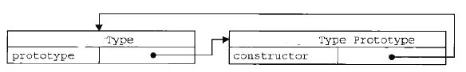

#原型
	1. 函数的prototype属性
		1. 每个函数都有一个prototype属性，它默认指向一个Object空对象（即称为：原型对象）
		2. 原型对象中有一个属性constructor，它指向函数对象
	2. 给原型对象添加属性（一般都是方法）
		作用：函数的所有实例对象自动拥有原型中的属性（方法）
	3. 原型对象中有一个属性constructor，它指向函数对象
		console.log(Date.prototype.constructor === Date);----------true

	4. alt+shift+l（vscode对函数重命名）